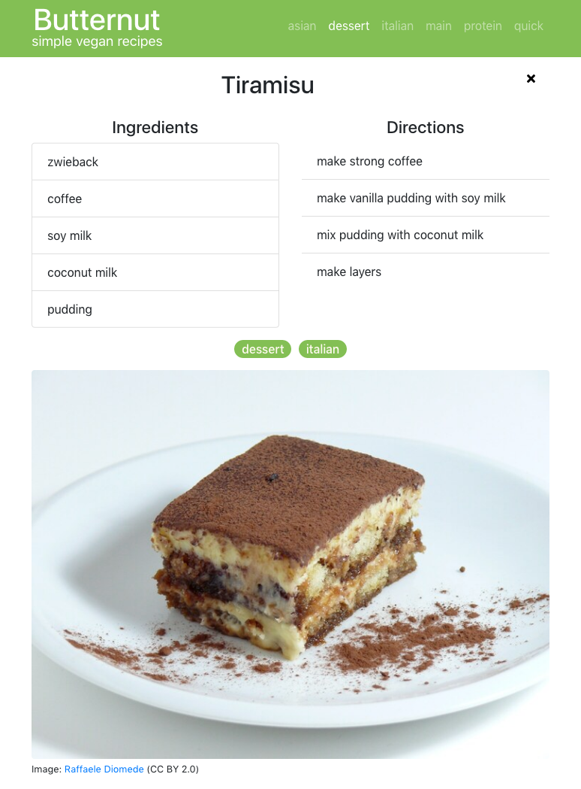

# Butternut

## Motivation

Many recipe web sites need pages of scrolling through large images, ads and irrelevant content to find the actual recipe. Butternut presents recipes in a slim way.

## Showcase

Try the [live demo](https://rumwerfer.github.io/butternut).

From a list with name and directions for each recipe, the actual recipe is just one click away. The list can be filtered by tags.

Screen estate is used sparingly, so even mobile users can find the relevant information with little effort. Images are included, but they have less priority than the actual information.

## Implementation

Butternut was developed using Javascript, React and Bootstrap. 

The main component has three children: `Header`, `List` and `Recipe`. In the list, recipes are rendered using the `Teaser` component.

React-router is used to display a recipe based on its id.

The `filter` for the recipe list is stored in the main component's state. A `setFilter` function is passed down to the header component via props. The filter itself is passed to the list component.

This was just a try-out project for myself to learn React. Eventually I'll fill it with actual recipes.
